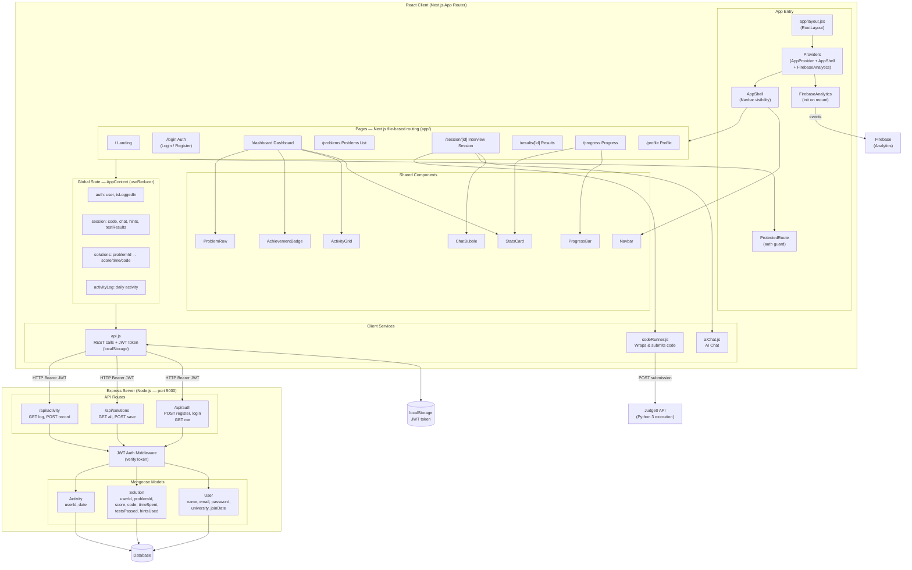
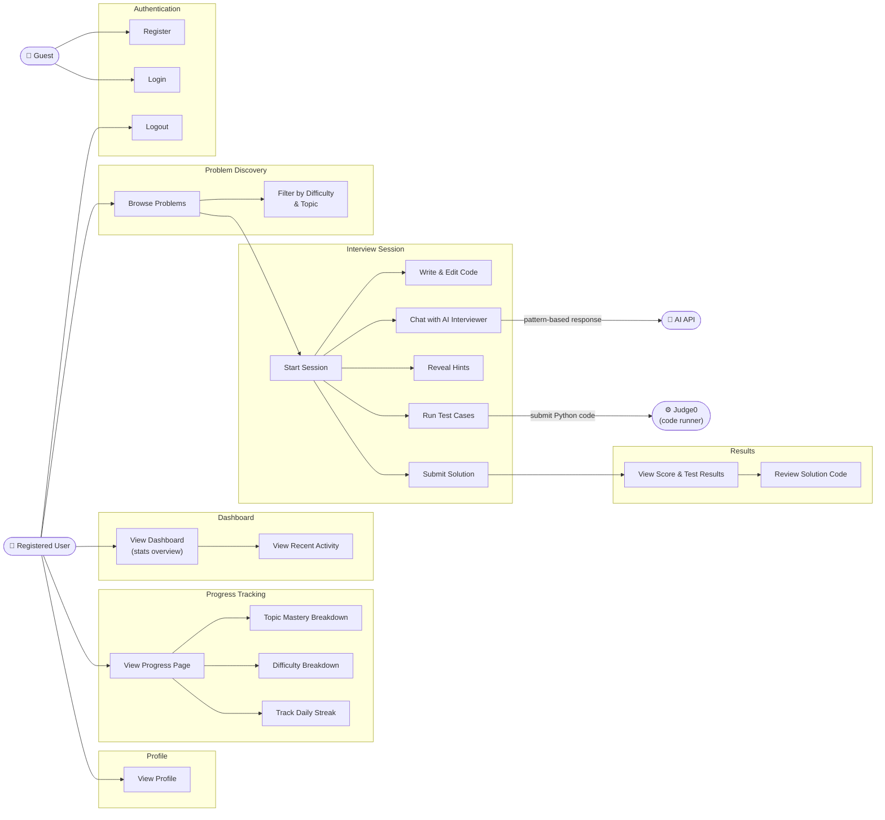

# Project Diagrams

## 1. Architecture Diagram

```mermaid
graph TB
    subgraph Client["React Client (Next.js App Router)"]
        direction TB

        subgraph AppEntry["App Entry"]
            Layout["app/layout.jsx\n(RootLayout)"]
            Providers["Providers\n(AppProvider + AppShell\n+ FirebaseAnalytics)"]
            AppShell["AppShell\n(Navbar visibility)"]
            ProtectedRoute["ProtectedRoute\n(auth guard)"]
            FirebaseAnalytics["FirebaseAnalytics\n(init on mount)"]
        end

        subgraph Pages["Pages — Next.js file-based routing (app/)"]
            Landing["/ Landing"]
            Auth["/login Auth\n(Login / Register)"]
            Dashboard["/dashboard Dashboard"]
            Problems["/problems Problems List"]
            Session["/session/[id] Interview Session"]
            Results["/results/[id] Results"]
            Progress["/progress Progress"]
            Profile["/profile Profile"]
        end

        subgraph SharedComponents["Shared Components"]
            Navbar["Navbar"]
            StatsCard["StatsCard"]
            ProgressBar["ProgressBar"]
            ActivityGrid["ActivityGrid"]
            AchievementBadge["AchievementBadge"]
            ProblemRow["ProblemRow"]
            ChatBubble["ChatBubble"]
        end

        subgraph GlobalState["Global State — AppContext (useReducer)"]
            Auth_State["auth: user, isLoggedIn"]
            Session_State["session: code, chat, hints, testResults"]
            Solutions_State["solutions: problemId → score/time/code"]
            Activity_State["activityLog: daily activity"]
        end

        subgraph Services["Client Services"]
            APIService["api.js\nREST calls + JWT token\n(localStorage)"]
            AIChat["aiChat.js\nAI Chat"]
            CodeRunner["codeRunner.js\nWraps & submits code"]
        end
    end

    subgraph Server["Express Server (Node.js — port 5000)"]
        direction TB

        subgraph Routes["API Routes"]
            AuthRoutes["/api/auth\nPOST register, login\nGET me"]
            SolutionRoutes["/api/solutions\nGET all, POST save"]
            ActivityRoutes["/api/activity\nGET log, POST record"]
        end

        AuthMW["JWT Auth Middleware\n(verifyToken)"]

        subgraph Models["Mongoose Models"]
            UserModel["User\nname, email, password,\nuniversity, joinDate"]
            SolutionModel["Solution\nuserId, problemId,\nscore, code, timeSpent,\ntestsPassed, hintsUsed"]
            ActivityModel["Activity\nuserId, date"]
        end
    end

    DB[("Database")]
    Judge0["Judge0 API\n(Python 3 execution)"]
    Firebase["Firebase\n(Analytics)"]
    LocalStorage[("localStorage\nJWT token")]

    Layout --> Providers
    Providers --> FirebaseAnalytics
    Providers --> AppShell
    AppShell --> Navbar
    AppShell --> Pages
    Pages --> ProtectedRoute

    Dashboard --> StatsCard
    Dashboard --> ActivityGrid
    Dashboard --> AchievementBadge
    Dashboard --> ProblemRow
    Session --> ChatBubble
    Progress --> ProgressBar
    Progress --> StatsCard

    Pages --> GlobalState
    GlobalState --> APIService
    Session --> AIChat
    Session --> CodeRunner

    APIService <--> LocalStorage

    APIService -->|"HTTP Bearer JWT"| AuthRoutes
    APIService -->|"HTTP Bearer JWT"| SolutionRoutes
    APIService -->|"HTTP Bearer JWT"| ActivityRoutes

    AuthRoutes --> AuthMW
    SolutionRoutes --> AuthMW
    ActivityRoutes --> AuthMW
    AuthMW --> UserModel
    AuthMW --> SolutionModel
    AuthMW --> ActivityModel

    UserModel --> DB
    SolutionModel --> DB
    ActivityModel --> DB

    CodeRunner -->|"POST submission"| Judge0
    FirebaseAnalytics -->|"events"| Firebase
```

---

## 2. Use Case Diagram

```mermaid
graph LR
    Guest(["👤 Guest"])
    User(["👤 Registered User"])
    AISystem(["🤖 AI API"])
    Judge0Sys(["⚙️ Judge0\n(code runner)"])

    subgraph Auth_UC["Authentication"]
        UC_Register["Register"]
        UC_Login["Login"]
        UC_Logout["Logout"]
    end

    subgraph Browse_UC["Problem Discovery"]
        UC_Browse["Browse Problems"]
        UC_Filter["Filter by Difficulty\n& Topic"]
    end

    subgraph Session_UC["Interview Session"]
        UC_Start["Start Session"]
        UC_Code["Write & Edit Code"]
        UC_Chat["Chat with AI Interviewer"]
        UC_Hint["Reveal Hints"]
        UC_Run["Run Test Cases"]
        UC_Submit["Submit Solution"]
    end

    subgraph Results_UC["Results"]
        UC_Results["View Score & Test Results"]
        UC_Review["Review Solution Code"]
    end

    subgraph Dashboard_UC["Dashboard"]
        UC_Dashboard["View Dashboard\n(stats overview)"]
        UC_Recent["View Recent Activity"]
    end

    subgraph Progress_UC["Progress Tracking"]
        UC_Progress["View Progress Page"]
        UC_TopicMastery["Topic Mastery Breakdown"]
        UC_DiffBreakdown["Difficulty Breakdown"]
        UC_Streak["Track Daily Streak"]
    end

    subgraph Profile_UC["Profile"]
        UC_Profile["View Profile"]
    end

    %% Guest flows
    Guest --> UC_Register
    Guest --> UC_Login

    %% Registered user flows (Login inherited via Guest)
    User --> UC_Logout
    User --> UC_Browse
    User --> UC_Dashboard
    User --> UC_Progress
    User --> UC_Profile

    %% Browse
    UC_Browse --> UC_Filter
    UC_Browse --> UC_Start

    %% Session internals
    UC_Start --> UC_Code
    UC_Start --> UC_Chat
    UC_Start --> UC_Hint
    UC_Start --> UC_Run
    UC_Start --> UC_Submit

    %% AI & Runner
    UC_Chat -->|"pattern-based response"| AISystem
    UC_Run -->|"submit Python code"| Judge0Sys

    %% After submit
    UC_Submit --> UC_Results
    UC_Results --> UC_Review

    %% Progress details
    UC_Progress --> UC_TopicMastery
    UC_Progress --> UC_DiffBreakdown
    UC_Progress --> UC_Streak

    %% Dashboard
    UC_Dashboard --> UC_Recent
```
